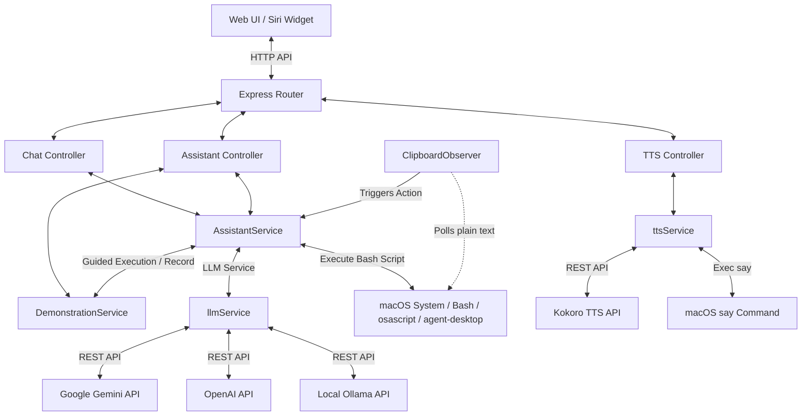

# Kriko - AI macOS Assistant & TTS Gateway

Kriko is a modern, modular Express.js assistant server. It connects to the web interface to enable:
1. **Siri-like Floating Overlay Widget**: A circular, glowing, pulsing floating bubble in the corner of your page that opens a compact chat interface.
2. **AI-driven macOS Control**: Natural language instructions compiled to executable Bash shell scripts (mixing shell, AppleScript, and `agent-desktop` commands) on the fly (via Google Gemini, OpenAI, or local Ollama models) with a self-healing error correction loop.
3. **Hardware & Reminders Integration**: Directly add macOS reminders, control system sound output volume, list running applications, and trigger voice syntheses.
4. **Text-to-Speech (TTS) Gateway**: Connects to the local Kokoro API (`:8998`) with a native macOS `say` fallback (active by default).
5. **Interactive UI Teaching & Demonstrations**: Record physical mouse/keyboard actions on screen to teach the assistant custom flows, saving them as guides that LLM scripts reuse for precise GUI targeting.
6. **Background Voice Trigger Clipboard Observer**: Automatically monitors clipboard text for trigger phrases (like "Kriko", "okay Kriko") to execute voice dictations in the background, speaking feedback out loud.

---

## Directory Layout

* `src/config/`: Configuration manager.
* `src/services/`: Separate layers for:
  * `llmService.js` (Adapters for Gemini, OpenAI, and local Ollama)
  * `assistantService.js` (Dynamic bash script writer, execution wrapper, and macOS integrations)
  * `ttsService.js` (Kokoro API client + macOS `say` voice generator)
  * `clipboardObserver.js` (Background pasteboard observer for voice triggers)
  * `demonstrationService.js` (OS accessibility tracker and GUI demonstration manager)
* `src/controllers/` & `src/routes/`: Router maps for API paths.
* `src/demonstrations/`: JSON recordings of custom GUI automation flows.
* `public/`: Beautiful UI dashboard incorporating the Siri fluid animation widget.

---

## System Architecture & Flow

### Component Diagram


### Sequence Flow: Dynamic Bash Script Execution & Self-Healing

```mermaid
sequenceDiagram
    autonumber
    actor User as Web Client
    participant Controller as ChatController / ClipboardObserver
    participant Service as AssistantService
    participant Demo as DemonstrationService
    participant LLM as LlmService
    participant APIs as LLM Providers (Gemini / OpenAI / Ollama)
    participant OS as macOS System

    User->>Controller: Trigger instruction
    Controller->>Service: executeDynamicAction({ instruction, provider })
    activate Service
    
    Service->>Service: getDetailedSystemContext()
    Service->>OS: Query system status (volume, running apps, frontmost app UI snapshot)
    OS-->>Service: System Context
    
    Service->>Demo: getMatchingDemonstration(instruction)
    Demo-->>Service: Matching Demonstration (Steps) or null
    
    rect rgb(40, 44, 52)
        note right of Service: Execution & Error Recovery Loop (Up to 2 Attempts)
        Service->>LLM: generateCode(prompt with context & demo steps)
        LLM->>APIs: Request code generation
        APIs-->>LLM: Generated code
        LLM-->>Service: Clean Bash script (no markdown fences)
        
        Service->>OS: Run Bash script (bash/osascript/agent-desktop)
        alt Bash script execution fails
            OS-->>Service: Execution Error
            note right of Service: Save error and retry
        else Bash script execution succeeds
            OS-->>Service: Execution Output
        end
    end

    opt Recording is active
        Service->>Demo: recordScriptAction(instruction, script)
    end
    
    Service-->>Controller: Return { script, output, attemptsUsed }
    deactivate Service
    Controller-->>User: JSON Response / Vocalized feedback
```


---


## Setup & Running

### 1. Prerequisites
* A macOS computer (needed for AppleScript executions and native TTS fallback). If run on non-macOS, actions and TTS are simulated gracefully.
* Node.js (v16+) and npm installed.

### 2. Configuration
1. Open the `.env` file in the project root.
2. Set your API credentials:
   ```env
   PORT=3000
   GEMINI_API_KEY=your_gemini_key_here
   OPENAI_API_KEY=your_openai_key_here

   # Local LLM (Ollama) Settings
   OLLAMA_API_URL=http://127.0.0.1:11434
   OLLAMA_MODEL=gemma2
   
   # Text to speech settings
   USE_KOKORO=false
   KOKORO_API_URL=http://100.105.203.102:8998
   ```

### 3. Run the Server
* Install dependencies:
   ```bash
   npm install
   ```
* Run in development mode (using nodemon):
   ```bash
   npm run dev
   ```
* Start the server in production mode:
   ```bash
   npm run start
   ```

### 4. Running a Local LLM with Ollama (Optional)
Kriko supports completely local, offline execution using local models running on your machine:
1. Install [Ollama](https://ollama.com).
2. Pull your model of choice (e.g. Google's Gemma 2):
   ```bash
   ollama pull gemma2
   ```
   *Alternative models:*
   - `gemma:2b` / `gemma:7b` / `gemma:4b` (Gemma variants)
   - `llama3` (Llama 3)
   - `mistral` (Mistral 7B)
   - `qwen2.5` (Qwen 2.5)
3. Ensure Ollama service is running, and configure `OLLAMA_MODEL` in your `.env` to match the model you pulled.
4. Select **Ollama (Local)** in the Provider dropdown on the UI dashboard or chat assistant to run local scripts!

---

## Web Dashboard & Siri Mode
Once the server is running, open:
```
http://localhost:3000
```
* **Developer Controls**: Directly test voice synthesis, add reminders, slide MacBook output volume, view running user processes, or dump application accessibility trees using `agent-desktop`.
* **Dynamic Chat**: Type commands (e.g. *"set volume to 20% and create a reminder to stand up"*). The assistant will write Bash scripts (mixing terminal commands, AppleScript, and `agent-desktop`), execute them, display collapsible code details, and vocalize responses.
* **Siri Widget Mode**: Click the **✨ Siri Widget Mode** button to collapse the dashboard into a floating, glowing Siri-orb. Click the orb to slide open a compact, Siri-like chat overlay widget.
# kriko
