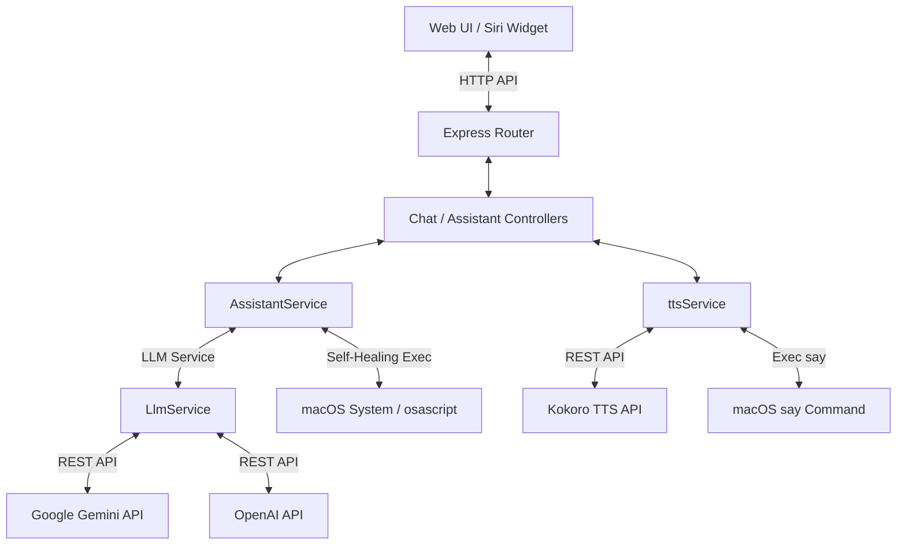

# Kriko - AI macOS Assistant & TTS Gateway

Kriko is a modern, modular Express.js assistant server. It connects to the web interface to enable:
1. **Siri-like Floating Overlay Widget**: A circular, glowing, pulsing floating bubble in the corner of your page that opens a compact chat interface.
2. **AI-driven macOS Control**: Natural language instructions compiled to AppleScript on the fly (via Gemini 1.5 Flash or ChatGPT) with a self-healing error correction loop.
3. **Hardware & Reminders Integration**: Directly add macOS reminders, control system sound output volume, list running applications, and trigger voice syntheses.
4. **Text-to-Speech (TTS) Gateway**: Connects to the local Kokoro API (`:8998`) with a native macOS `say` fallback (active by default).

---

## Directory Layout

* `src/config/`: Configuration manager.
* `src/services/`: Separate layers for:
  * `llmService.js` (Adapters for Gemini & OpenAI)
  * `assistantService.js` (Dynamic script writer, exec, and macOS integrations)
  * `ttsService.js` (Kokoro client + macOS `say` generator)
* `src/controllers/` & `src/routes/`: Router maps for API paths.
* `public/`: Beautiful UI dashboard incorporating the Siri fluid animation widget.

---

## System Architecture & Flow

### Component Diagram


### Sequence Flow: Dynamic AppleScript Execution & Self-Healing

```mermaid
sequenceDiagram
    autonumber
    actor User as Web Client
    participant Controller as ChatController
    participant Service as AssistantService
    participant LLM as LlmService
    participant APIs as LLM APIs (Gemini/OpenAI)
    participant OS as macOS (osascript)

    User->>Controller: POST /api/chat { instruction }
    Controller->>Service: executeDynamicAction(instruction)
    activate Service
    
    Service->>OS: Get context (volume, running processes)
    OS-->>Service: System Context
    
    rect rgb(40, 44, 52)
        note right of Service: Execution & Error Recovery Loop (Up to 2 Attempts)
        Service->>LLM: generateCode(prompt with context)
        LLM->>APIs: REST API Request
        APIs-->>LLM: Response text
        LLM-->>Service: Clean AppleScript (no markdown fences)
        Service->>OS: Run AppleScript via osascript
        alt osascript execution fails
            OS-->>Service: Execution Error
            note right of Service: Append error details to prompt and retry
        else osascript execution succeeds
            OS-->>Service: Execution Output
        end
    end
    
    Service-->>Controller: Return { script, output, attemptsUsed }
    deactivate Service
    Controller-->>User: JSON Response
```


---


## Setup & Running

### 1. Prerequisites
* A macOS computer (needed for AppleScript executions and native TTS fallback). If run on non-macOS, actions and TTS are simulated gracefully.
* Node.js (v16+) and npm installed.

### 2. Configuration
1. Open the `.env` file in the project root.
2. Set your API credentials:
   ```env
   PORT=3000
   GEMINI_API_KEY=your_gemini_key_here
   OPENAI_API_KEY=your_openai_key_here
   
   # Text to speech settings
   USE_KOKORO=false
   KOKORO_API_URL=http://100.105.203.102:8998
   ```

### 3. Run the Server
* Install dependencies:
  ```bash
  npm install
  ```
* Run in development mode (using nodemon):
  ```bash
  npm run dev
  ```
* Start the server in production mode:
  ```bash
  npm run start
  ```

---

## Web Dashboard & Siri Mode
Once the server is running, open:
```
http://localhost:3000
```
* **Developer Controls**: Directly test voice synthesis, add reminders, slide MacBook output volume, view running user processes, or dump application accessibility trees using `agent-desktop`.
* **Dynamic Chat**: Type commands (e.g. *"set volume to 20% and create a reminder to stand up"*). The assistant will write AppleScript, execute it, display collapsible code details, and vocalize responses.
* **Siri Widget Mode**: Click the **✨ Siri Widget Mode** button to collapse the dashboard into a floating, glowing Siri-orb. Click the orb to slide open a compact, Siri-like chat overlay widget.
# kriko
